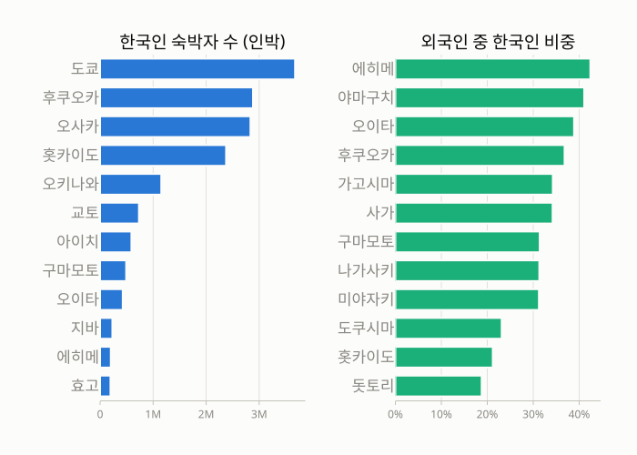
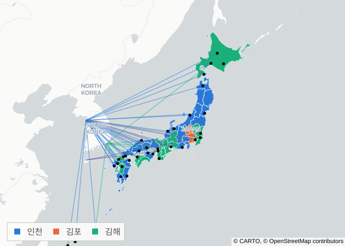
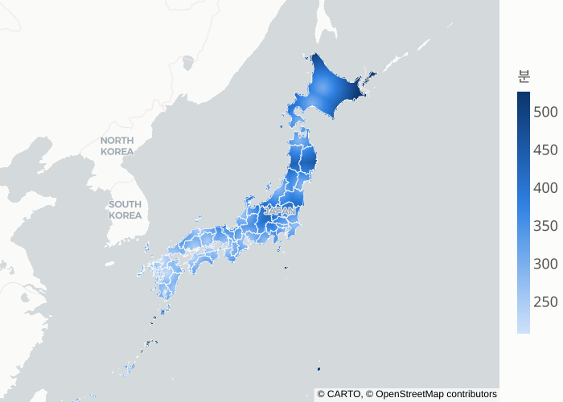
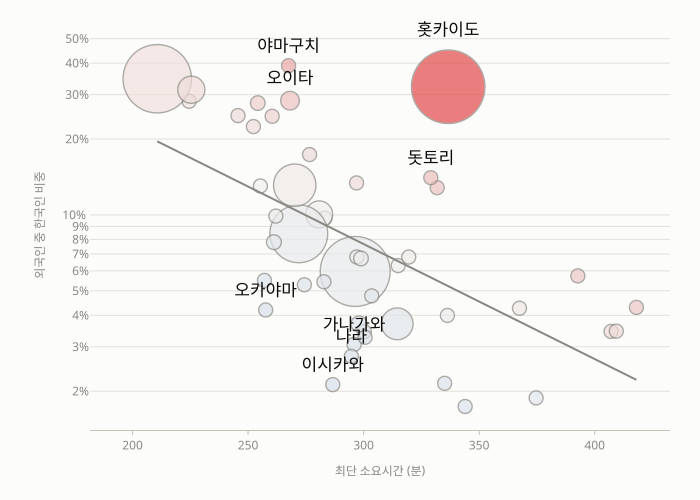
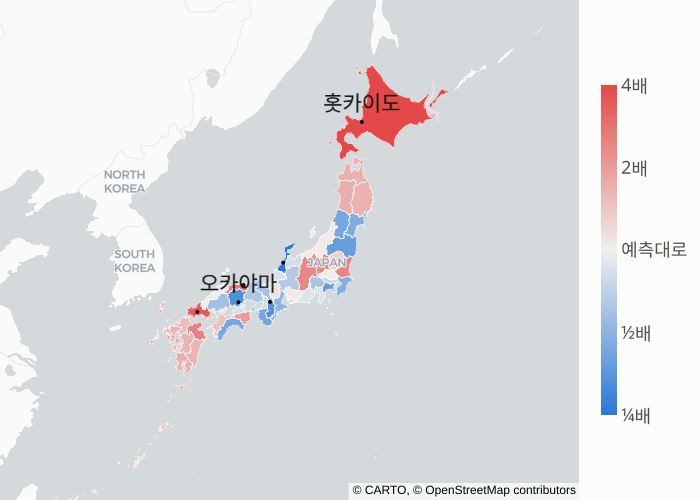
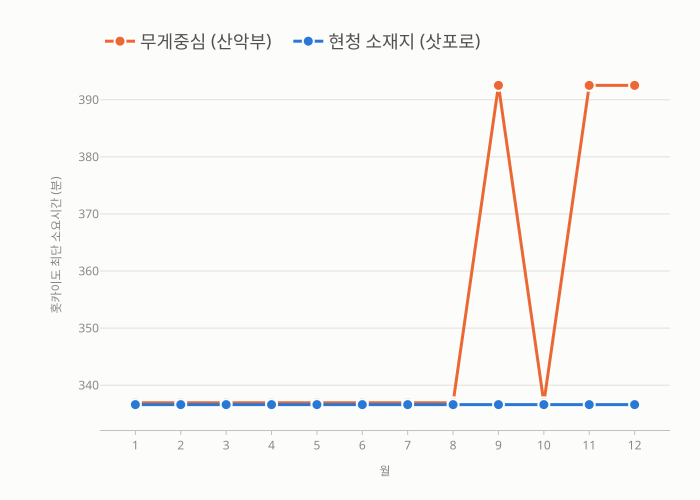
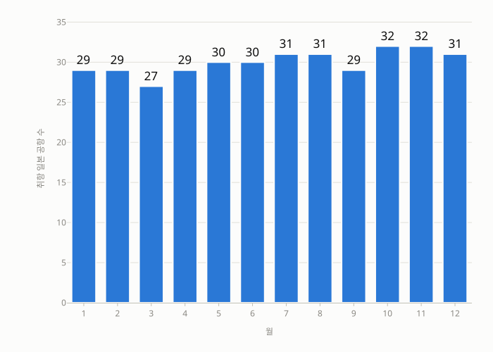

<!-- 한국에서 일본은 얼마나 가까운가 — 슬라이드 정본
     문법: AgentArmory/rules/deck_project_template.yaml §deck_syntax
       ## 헤드라인   슬라이드 시작. **헤드라인이 그 슬라이드의 주장이다**
       @ 45초 · 근거 fig-01 · 유형 주장 · 배치 2단
       - 불릿
       
       ::원고 … ::   발표자 원고. 화면에 안 찍힌다

     문체: **화면은 명사형, 입은 구어체.**
     설계: 00_설계/storyline.md 가 이 파일보다 먼저다. 순서를 뒤집지 않는다.
     검사: python <아머리>/tools/deck_check.py --deck .

     근거 id 는 부모의 _meta/lineage.csv 의 산출물 경로다(등급 재현가능).
     claims.csv 는 `확정` 인 claim-02·03·04 만 인용한다 —
     나머지는 근거대기·근거부족이라 발표에 쓰지 않는다.
-->

# 한국에서 일본은 얼마나 가까운가
@ 15초 · 유형 전이

- 접근성과 실제 방문의 어긋남 지도
- 이창효 · 도시데이터 분석스쿨 캡스톤 · 2026-08-27

::원고
안녕하십니까. 이창효입니다.
한국에서 일본이 얼마나 가까운지를 재고, 실제로 한국인이 어디에 묵는지와 겹쳐 봤습니다.
두 지도가 어긋나는 곳을 찾는 발표입니다.
::

## 한국인 수 1위 도쿄, 비중 순위에는 없음
@ 65초 · 근거 annual.csv · 유형 주장 · 배치 2단

- 수 1위 도쿄 · 비중 1위 에히메 42%
- 외국인 숙박객 중 한국인 비중, 전국 11.5%
- 비중 상위 열두 곳에 도쿄·오사카 없음
- 물음 — 비중 높은 곳은 가까운 곳인가

::원고
먼저 이 그림부터 보겠습니다.
왼쪽은 한국인 숙박자 수 상위, 오른쪽은 외국인 숙박객 중 한국인이 차지하는 비중 상위입니다.
왼쪽 1위는 도쿄입니다. 그런데 오른쪽에는 도쿄가 없습니다. 오사카도 없습니다.
비중 1위는 에히메로 42%, 외국인 열 명 중 넷이 한국인입니다. 전국 평균은 11.5%입니다.
여기서 비중은 그 지역에 묵은 외국인 전체를 분모에, 한국인을 분자에 둔 값입니다.
에히메는 시코쿠 서쪽, 마쓰야마가 있는 곳입니다. 인구로는 작은 현입니다.
규모로 보면 도쿄가 압도적인데, 그 도쿄는 다른 나라 관광객이 더 압도적으로 많은 곳입니다.
그래서 규모 대신 비중을 봤고, 여기서 물음이 나왔습니다.
비중이 높은 곳은 한국에서 가까운 곳일까요.
::

## 그 달 운항한 노선만으로 최단 경로 계산
@ 60초 · 근거 routes.csv, airports_jp.csv, grid_access.csv · 유형 방법 · 배치 2단

- 수속 165분 + 비행 + 지상이동 60km/h 근사
- 출발 넷 × 도착 서른다섯 중 가장 빠른 하나
- 2025년 140,782편 · 노선 524건
- 홋카이도는 김해권 — 부산이 서울보다 동쪽
- 경계 원자료의 독도 = 시마네현 → 링 제외

::원고
접근성은 이렇게 쟀습니다.
출입국 수속 165분을 깔고, 대권거리로 비행시간을 내고,
공항에서 지역까지 지상이동을 시속 60킬로미터로 근사했습니다.
출발은 인천·김포·김해·제주 네 곳입니다.
핵심은 노선을 연간 목록이 아니라 그 달 실제로 뜬 것만 썼다는 점입니다.
2025년 네 공항에서 일본으로 14만 편이 떴고, 노선은 524건입니다.
지도의 색은 어느 공항이 그 지역에 가장 빨리 닿는지입니다.
눈에 띄는 것은 홋카이도가 김해권이라는 점입니다.
부산이 서울보다 동쪽이라 신치토세까지 더 가깝습니다.
그리고 경계 원자료가 독도를 시마네현에 넣어 놨습니다. 그 링은 뺐습니다.
::

## 공급은 연속, 수요는 47덩어리
@ 50초 · 근거 grid_cells.csv, grid_access.csv · 유형 자료

- 10km 격자 3,953칸 · 칸마다 최단 소요시간
- 방문 자료의 최소 단위는 도도부현 47개
- 격자에 접근성만 있는 이유 — 비대칭 자체가 발견

::원고
접근성은 좌표만 있으면 계산됩니다.
그래서 일본 국토를 10킬로미터 격자 3,953칸으로 덮고 칸마다 최단 소요시간을 냈습니다.
이 그림에서 색은 연속으로 변합니다. 흰 선이 도도부현 경계입니다.
문제는 방문 자료입니다. 한국인 숙박은 국적별 분해가 도도부현까지만 공표됩니다.
즉 공급 쪽은 연속인데 수요 쪽은 47개 덩어리입니다.
그래서 이 격자에는 접근성만 있고 방문은 없습니다.
저는 이 비대칭을 한계로만 적지 않고 발견으로 적었습니다.
공간 단위를 어디까지 쪼갤 수 있느냐가 무엇을 볼 수 있느냐를 정하기 때문입니다.
::

## 가까울수록 비중 높음, 다만 인과 아님
@ 70초 · 근거 panel.csv · 유형 주장 · 배치 2단

- 로그-선형 + 월 고정효과 · 결정계수 0.377
- 이 값은 파일에 없음 — analyze.py 콘솔값
- 역인과 — 수요가 있어 노선이 생겼을 수 있음
- 이 연구가 보는 것은 선이 아니라 벗어난 점

::원고
이제 둘을 겹칩니다.
가로축은 최단 소요시간, 세로축은 한국인 비중이고 둘 다 로그 축입니다.
원 크기는 한국인 숙박자 수입니다.
월 고정효과를 넣은 로그-선형 회귀에서 결정계수는 0.377이 나왔습니다.
고정효과는 성수기와 비수기가 만드는 전국 공통의 차이를 걷어내려고 넣었습니다.
여기서 두 가지를 분명히 하겠습니다.
첫째, 이 값은 지금 어느 결과 파일에도 저장돼 있지 않습니다. analyze.py 가 콘솔에만 찍습니다.
그래서 발표 전에 다시 돌려 확인한 값입니다.
둘째, 이것은 인과가 아닙니다. 방향이 반대일 수 있습니다.
한국인이 많이 가니까 노선이 생겼을 수 있고, 실제로 그쪽이 더 그럴듯한 지역도 있습니다.
그래서 제가 보려는 것은 이 선이 아니라 선에서 벗어난 점들입니다.
::

## 예측 대비 ¼배에서 4배까지 벌어짐
@ 60초 · 근거 annual.csv, claim-02, claim-03, claim-04 · 유형 주장

- 과소 — 이시카와 0.20 · 오카야마 0.41
- 초과 — 홋카이도 3.66 · 야마구치 3.52
- 히로시마 282분으로 가까우나 예측의 0.48배

::원고
회귀에서 나온 잔차를 지도로 옮긴 것이 이 그림입니다.
회색은 예측대로, 파랑은 예측보다 적게 온 곳, 빨강은 예측보다 많이 온 곳입니다.
먼저 들어오는 것은 홋카이도입니다. 예측의 3.66배입니다.
소요시간으로는 다섯 시간 반이 넘는데도 그렇습니다.
반대쪽은 이시카와입니다. 예측의 0.20배, 즉 5분의 1입니다. 가나자와가 있는 곳입니다.
오카야마도 0.41배로 같은 쪽에 있습니다.
히로시마도 파랑입니다. 282분이면 가까운 편인데 예측의 0.48배에 그칩니다.
이 파란 곳들이 이 프로젝트가 내놓는 목록입니다.
왜 안 오는지는 이 자료로 답하지 못합니다. 어디를 봐야 하는지까지가 여기서 나옵니다.
::

## 가나가와 4.4% — 당일치기로 설명 안 됨
@ 50초 · 근거 annual.csv · 유형 주장 · 배치 강조

- 전국 11.5% · 도쿄 7.2% · 가나가와 4.4%
- 당일치기는 모든 국적에 동일 — 비율에서 상쇄
- 하코네·가마쿠라에서 자는 쪽은 다른 나라 손님

::원고
여기서 오해를 하나 먼저 끊겠습니다.
가나가와가 낮은 것은 도쿄에서 자고 당일로 다녀오기 때문 아니냐는 지적이 나옵니다.
그렇게 설명하면 틀립니다. 당일치기는 한국인만 하는 것이 아닙니다.
모든 국적이 똑같이 합니다. 그래서 비율을 쓰면 그 효과는 분자와 분모에서 함께 상쇄됩니다.
그런데도 가나가와는 4.4%입니다.
전국 평균 11.5%의 절반도 안 되고, 옆에 붙은 도쿄 7.2%보다도 낮습니다.
즉 하코네나 가마쿠라에서 하룻밤 자는 외국인 중에 한국인 비율이 유난히 낮다는 뜻입니다.
규모가 아니라 비중을 쓴 덕에 보이는 것입니다.
::

## 대표점 한 점이 어긋남을 두 배로 부풀림
@ 70초 · 근거 panel.csv, panel_by_dep.csv · 유형 주장 · 배치 2단

- 무게중심은 다이세쓰잔 → 최적 공항 아사히카와
- 아사히카와 월 20~30편 vs 신치토세 월 600편대
- 노선 쉬는 달 56분 튐 → 그 달 어긋남 두 배
- 현청 소재지로 교체 → 12개월 337분 평탄

::원고
이 발표에서 제가 제일 오래 붙잡은 것이 이 그림입니다.
도도부현을 점 하나로 줄여야 거리를 잽니다. 처음에는 기하학적 무게중심을 썼습니다.
그런데 홋카이도의 무게중심은 다이세쓰잔 산악지대입니다.
홋카이도 한가운데 있는 국립공원이고, 사람이 살지 않는 곳입니다.
그러자 최적 도착공항이 삿포로 신치토세가 아니라 아사히카와로 잡혔습니다.
신치토세는 한 달에 600편대가 뜨는데 아사히카와는 스무 편 남짓입니다.
그래서 아사히카와 노선이 쉬는 달마다 홋카이도 소요시간이 56분씩 튀었고,
그 달의 어긋남이 두 배로 부풀었습니다. 주황색 선입니다.
대표점을 현청 소재지로 바꾸니 파란 선처럼 12개월 내내 337분으로 평탄해집니다.
자료도 모형도 그대로인데 결과만 바뀐 것입니다.
::

## 취항 공항 수가 달마다 27~32개로 바뀜
@ 45초 · 근거 routes.csv · 유형 주장 · 배치 2단

- 연중 누계 35개, 어느 달에도 35개는 아님
- 계절 운항이 그대로 접근성에 반영됨
- 연간 합계로 집계하면 사라지는 변동

::원고
마지막 발견은 시간 축입니다.
일본에 취항하는 공항 수를 달마다 세면 27개에서 32개 사이에서 움직입니다.
연중 누계로는 35개인데, 어느 한 달을 봐도 35개가 다 뜨는 달은 없습니다.
겨울에 뜨다 여름에 쉬는 노선이 있고 그 반대도 있습니다.
이 프로젝트가 노선을 연간 목록이 아니라 월별로 쓴 이유가 여기 있습니다.
연간 합계로 접근성을 계산하면 이 변동은 통째로 사라집니다.
그리고 앞의 홋카이도처럼, 사라진 변동이 결과를 흔들고 있었는지는 나중에야 알게 됩니다.
::

## 이 지도가 말하지 않는 것 다섯
@ 60초 · 근거 panel.csv, grid_cells.csv · 유형 주장 · 배치 비교

- 인과 아님 — 역인과 가능
- 한국 안에서 공항까지 가는 시간 미포함
- 지상이동은 직선거리 60km/h 근사
- 숙박자 ≠ 방문자 · 종업원 10인 이상 시설 기준
- 격자에 방문 없음 — 자료 단위가 도도부현
- 표본오차 큰 참고값 셀 17 / 564

::원고
한계를 몰아서 말씀드립니다.
첫째, 이것은 인과가 아닙니다. 수요가 있어서 노선이 생겼을 가능성을 배제하지 못합니다.
둘째, 한국 안에서 공항까지 가는 시간이 빠져 있습니다.
네 공항에 이미 도착해 있다고 가정한 국가 단위 접근성이고,
서울에 사는 사람에게 김해는 실제로 훨씬 멉니다.
셋째, 지상이동은 직선거리에 시속 60킬로미터를 가정한 근사입니다. 바다도 그냥 건넙니다.
넷째, 숙박자는 방문자가 아니고, 통계 자체가 종업원 열 명 이상 시설만 셉니다.
지방이 과소평가됩니다.
다섯째, 격자에는 방문이 없습니다. 이건 게으름이 아니라 자료의 최소 단위 문제입니다.
국적별 숙박이 도도부현까지만 공표되기 때문입니다.
::

## 가까움은 잰 값이 아니라 정한 값
@ 45초 · 유형 마무리 · 배치 인용

- 어긋남 지도와 월별 접근성 — 앱에서 지역별로 확인

::원고
정리하겠습니다.
이 발표에서 숫자 하나만 가져가신다면 결정계수가 아니라 56분이었으면 합니다.
대표점을 어디에 찍느냐로 홋카이도가 56분씩 흔들렸고, 그것만으로 어긋남이 두 배가 됐습니다.
자료도 모형도 그대로였습니다.
가까움은 재서 나오는 값처럼 보이지만,
어디를 그 지역이라고 부를지 정하는 순간 이미 절반은 정해집니다.
여러분 분석에서도 공간 단위와 대표점을 먼저 의심해 보시기 바랍니다.
앱에서는 관심 있는 지역을 골라 어긋남을 직접 보실 수 있습니다.
감사합니다.
::

## 세력권도 계절을 탄다 — 제주는 석 달만
@ 60초 · 근거 grid_access.csv, grid_cells.csv · 유형 자료 · 배치 2단 · 숨김

- 연평균 인천 63.0 · 김해 32.4 · 김포 4.1 · 제주 0.5%
- 제주는 10~12월에만 최적, 최대 3.2%
- 김해 9월 44.1% — 원인 미확인

::원고
백업입니다. 세력권을 달마다 나눠 보면 제주는 열 달 동안 한 칸도 못 가져갑니다.
일본 대부분에서 김해가 더 가깝기 때문입니다.
김해가 9월에 44.1%까지 튀는데, 원인은 아직 확인하지 못했습니다.
확인하지 않은 것을 설명으로 채우지 않겠습니다.
::

## 경계 원자료가 분쟁 지역을 일본 영역으로 담고 있음
@ 60초 · 근거 japan_pref_simple.geojson · 유형 자료 · 숨김

- 독도 → 시마네현 3링 · 센카쿠 → 오키나와 17링
- 하보마이·시코탄·에토로후 → 홋카이도
- load_boundaries() 가 좌표 경계상자로 링 제외, 실행마다 출력
- build_scenarios.py 는 이 함수를 우회 — 확인 전 단정 금지

::원고
백업입니다. 원자료는 dataofjapan/land 의 도도부현 경계이고,
독도를 시마네현 안에 세 개 링으로 담고 있습니다.
경계를 읽는 함수에서 그 링들을 뺐고, 실행할 때마다 무엇을 몇 개 뺐는지 콘솔에 찍습니다.
다만 공항과 도도부현을 잇는 코드 한 곳이 이 함수를 우회합니다.
그래서 모든 경로에 적용됐다고는 아직 말하지 않겠습니다.
::

## 접근성 계산식과 가정값
@ 60초 · 근거 panel_by_dep.csv, grid_by_dep.csv · 유형 방법 · 숨김

- 총 소요 = 수속 165분 + 비행 + 지상이동
- 비행 = 대권거리 ÷ 800km/h + 이착륙 25분
- 지상 = 대권거리 ÷ 60km/h · 평면투영 없이 대권거리
- 공항 보유 29개 현 평균 276분 · 미보유 18개 현 333분
- 최단 후쿠오카 211분 · 최장 아키타 409분

::원고
백업입니다. 계산식은 세 덩어리입니다.
출입국 수속에 165분, 비행은 대권거리를 시속 800킬로미터로 나누고 이착륙 25분을 더합니다.
지상이동은 대권거리를 시속 60킬로미터로 나눕니다.
공항을 가진 현은 평균 276분, 없는 현은 333분입니다.
가장 가까운 곳이 후쿠오카 211분, 가장 먼 곳이 아키타 409분입니다.
::
